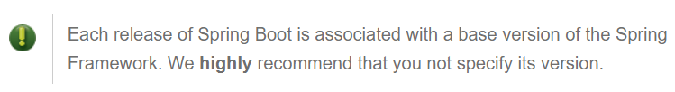

### Day 01. 스프링 부트 시작하기

jar파일로 배포가능 (war파일로도 할 수는 있음)

spring boot에는 내장톰캣이 있어서 jar파일로 배포하면 톰캣이 딸려감.

Java만 깔려있는 환경에 웹App을 실행시킬 수가 있음.

#### 환경

Spring Boot 2.0.2 는 Java8/9 , Spring Framework 5.0.6 을 사용한다.

서블릿3.0 이상인 컨테이너로 사용가능
(Tomcat 8.5, Jetty9.4, Undertow 1.4)

#### 설치

spring boot 의 jar파일을 classpath에 추가하기만 하면 스프링 부트가 설치된다

(즉, Gradle/Maven을 통하여 의존성을 추가하기만 하면 된다.)


  ```xml
      <parent>
          <groupId>org.springframework.boot</groupId>
          <artifactId>spring-boot-starter-parent</artifactId>
          <version>2.0.2.RELEASE</version>
      </parent>
  ```

  dependency들의 spring-boot 버전들을 명시하지 않아도

  parent의 version을 따르도록 해줌



