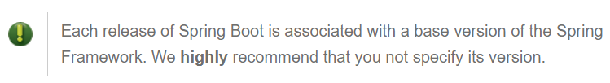
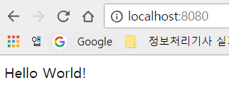

# Day 01. 스프링 부트 시작하기

**`Spring Boot Reference v2.0.2 ( 1.1 ~ 11.4 )`**

&nbsp;

jar파일로 배포가능 (war파일로도 할 수는 있음)

spring boot에는 내장톰캣이 있어서 jar파일로 배포하면 톰캣이 딸려감.

Java만 깔려있는 환경에 웹App을 실행시킬 수가 있음.

## 환경

Spring Boot 2.0.2 는 Java8/9 , Spring Framework 5.0.6 을 사용한다.

서블릿3.0 이상인 컨테이너 사용가능
(Tomcat 8.5, Jetty9.4, Undertow 1.4)

## 설치

spring boot 의 jar파일을 classpath에 추가하기만 하면 스프링 부트가 설치된다

(즉, Gradle/Maven을 통하여 의존성을 추가하기만 하면 된다.)


  ```xml
      <parent>
          <groupId>org.springframework.boot</groupId>
          <artifactId>spring-boot-starter-parent</artifactId>
          <version>2.0.2.RELEASE</version>
      </parent>
  ```

  dependency들의 spring-boot 버전들을 명시하지 않아도

  parent의 version을 따르도록 해줌




&nbsp;
&nbsp;

## 시작하기

&nbsp;

### 1. Maven에 의존성 추가

```xml
<?xml version="1.0" encoding="UTF-8"?>
<project xmlns="http://maven.apache.org/POM/4.0.0"
         xmlns:xsi="http://www.w3.org/2001/XMLSchema-instance"
         xsi:schemaLocation="http://maven.apache.org/POM/4.0.0 http://maven.apache.org/xsd/maven-4.0.0.xsd">
    <modelVersion>4.0.0</modelVersion>

    <groupId>me.bactoria</groupId>
    <artifactId>project</artifactId>
    <version>1.0-SNAPSHOT</version>

    <parent>
        <groupId>org.springframework.boot</groupId>
        <artifactId>spring-boot-starter-parent</artifactId>
        <version>2.0.2.RELEASE</version>
    </parent>

    <dependencies>
        <dependency>
            <groupId>org.springframework.boot</groupId>
            <artifactId>spring-boot-starter-web</artifactId>
        </dependency>
    </dependencies>

</project>
```

&nbsp;

### 2. Controller 생성

```java
/*just follow https://projects.spring.io/spring-boot */

package me.bactoria.project;

import org.springframework.boot.*;
import org.springframework.boot.autoconfigure.*;
import org.springframework.stereotype.*;
import org.springframework.web.bind.annotation.*;

@Controller
@EnableAutoConfiguration
public class SampleController {

    @RequestMapping("/")
    @ResponseBody
    String home() {
        return "Hello World!";
    }

    public static void main(String[] args) throws Exception {
        SpringApplication.run(SampleController.class, args);
    }
}
```

&nbsp;

### 3. 실행
`localhost:8080` 접속



&nbsp;
&nbsp;
&nbsp;

## Stereotype-annotation

**`@Component`** : 기본 스테레오타입. 다른 Stereotype-annotation을 포함함.

**`@RestController`** : @Controller와 @ResponseBody를 합친 기능

**`@Controller`** : MVC의 컨트롤러임을 명시, 프레젠테이션 레이어의 컨트롤러 컴포넌트

**`@Service`** : 비지니스 서비스, 서비스 레이어, 비지니스 로직이 들어가는 Service로 등록

**`@Repository`** : Dao에 적용, DB Exception Translation을 자동으로 해줌, 퍼시스턴트 레이어 , 영속성을 가지는 속성(파일,데이터베이스 등)

**스프링에서는 @Component보다 @Repository, @Service, @Controller,@RestController를 권장**

&nbsp;
&nbsp;
&nbsp;

### 참고자료

[Spring Boot Reference Guide - 2.0.2.Release](https://docs.spring.io/spring-boot/docs/2.0.2.RELEASE/reference/htmlsingle/#using-boot-maven)

[스프링 부트 2.0 Day 1. 스프링 부트 시작하기 - by 백기선 님](https://www.youtube.com/watch?v=CnmTCMRTbxo&index=1&list=PLfI752FpVCS8tDT1QEYwcXmkKDz-_6nm3)

[[Spring Boot] 어노테이션(Annotation) 이란? - by 밀크쉐잌 님](http://milkshake91.tistory.com/5)
