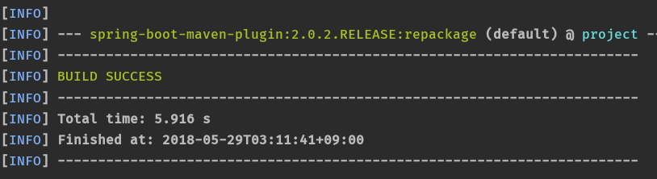
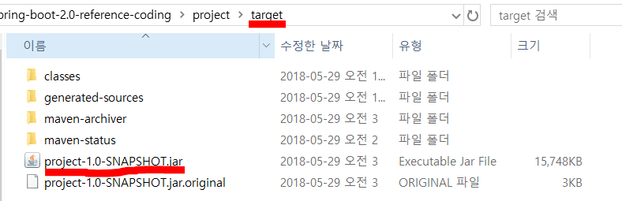
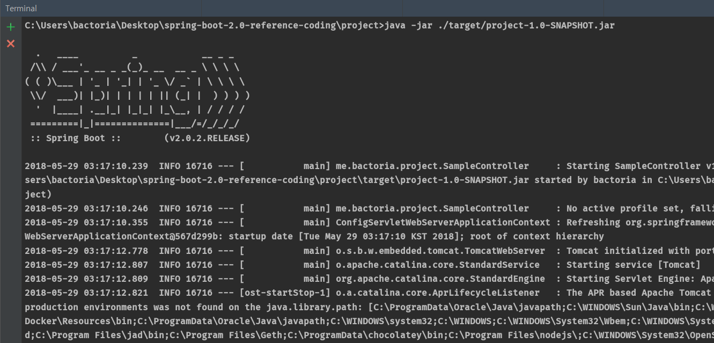
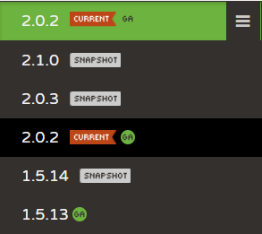

# Day 02. Executable JAR 어떻게 만들고 어떻게 동작하는가

`( Spring Boot Reference 11.5 ~ 13.4 )`

**`fat jars`**

컴파일된 클래스들과 어플리케이션을 실행하는데 필요한 모든 의존 jar들을 포함하고 있는 압축파일.

그럼.. java만 설치되어있어도 모든것을 실행시킬수가 있네.


**maven에 plugin 추가**

```XML
<build>
	<plugins>
		<plugin>
			<groupId>org.springframework.boot</groupId>
			<artifactId>spring-boot-maven-plugin</artifactId>
		</plugin>
	</plugins>
</build>
```

다음 소스를 추가하고

`mvn package` 를 터미널에 입력하면



위와 같이 빌드 성공한다.

(빌드 실패하면 방화벽 때문일 수 있음.)

&nbsp;



target 폴더에 정상적으로 올라왔다.



이렇게 쉽게 배포 가능하다.

&nbsp;

&nbsp;

**`Dependency Management`**

maven에 `spring-boot-starter-parent` 를 추가하여 의존성 관리를 지원받을 수 있다.

물론 사용자가 직접 각 dependency의 버전을 명시할 수 있다.

하지만, 스프링프레임워크 만큼은 버전을 바꾸지 않도록 권고하고 있다. 스프링부트가 스프링 프레임워크에 강력하게 의존하고 있기 때문.

dependency를 추가할 때 parent에서 버전을 관리하는 것은 왠만하면 직접 추가하지 않도록 하자. 꼭 필요한 경우가 아니면.

&nbsp;

**`spring-boot-starter-parent`**

* Java1.8 컴파일
* UTF-8 인코딩
* spring-boot-starter-dependency를 상속하여 의존성을 관리
* 리소스 필터링 ( <filter> )
* plugin 설정
* 프로퍼티,yml파일의 리소스 필터링

&nbsp;
&nbsp;

##라이브러리/프레임워크 버전



**`snap-shot`** : 데일리 빌드 버전.

**`M (Milestone)`** : 테스트버전. 주요 기능들이 구현될 때마다 개발자들로부터 피드백을 받기 위한 버전 ( 추후 나오는 GA버전과 인터페이스나 기능이 다를 수도 있음)

**`RC (Release Candidate)`** : 베타버전. 안정적으로 동작하는 것을 보장할 수는 없다.

**`GA (General Availability)`** : 정식 릴리즈 버전. 가장 안정적

(spring boot는 GA버전만 maven 저장소에 올라감.)

다른 라이브러리/프레임워크는 모르겠다.


&nbsp;
&nbsp;
&nbsp;

### 참고자료

[Spring Boot Reference Guide - 2.0.2.Release](https://docs.spring.io/spring-boot/docs/2.0.2.RELEASE/reference/htmlsingle/#using-boot-maven)

[스프링 부트 2.0 Day 02. Executable JAR 어떻게 만들고 어떻게 동작하는가 - by 백기선 님](https://www.youtube.com/watch?v=PicKx3lDGLk)
