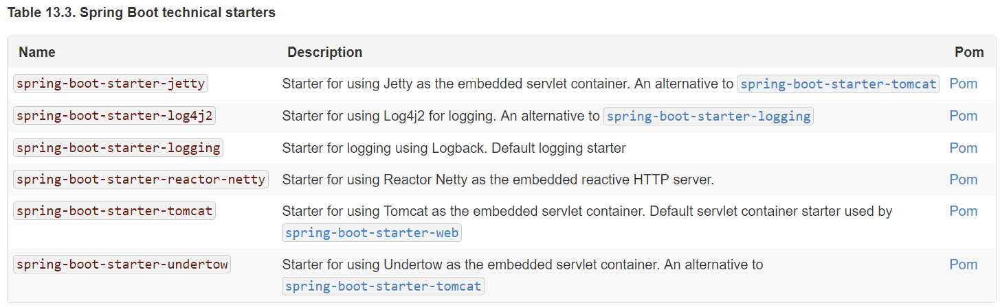
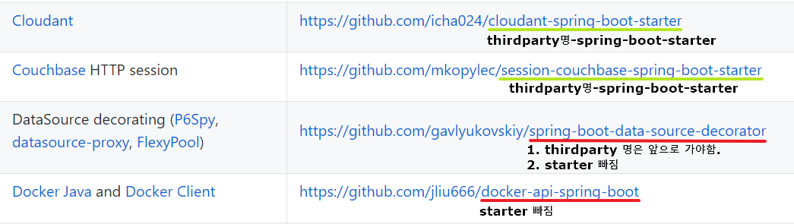
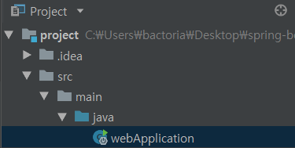

# Day 03. 스프링 부트 스타터

**`Spring Boot Reference v2.0.2 ( 13.5 ~ 15.1 )`**

&nbsp;

## starter

Official은 `spring-boot-starter` 로 시작하고,

써드파티는 `써드파티명-spring-boot-starter` 로 시작한다.

`spring-boot-starter-data-jpa` 라는 의존성을 프로젝트에 추가하면 jpa를 사용할 때 필요한 모든 의존적인 것들이 한번에 들어온다. 따로 신경쓸 필요가 없다.

그럼.. 스프링은 안들어와..?

spring-boot-starter 들은 공식문서에서 확인할 수 있다.




**log**
default: spring-boot-starter-logging (Logback)
log4j2로 바꿔끼울 수 있음.

**servlet**
default: spring-boot-starter-tomcat
jetty,undertow 로 바꿔끼울 수 있음.

&nbsp;
&nbsp;

[써드파티 starter](https://github.com/spring-projects/spring-boot/blob/master/spring-boot-project/spring-boot-starters/README.adoc)



명명규칙을 제대로 따르지 않는 것들이 많다.

docs에서는 명명규칙이 나오기 전에 나온것들은 규칙을 따르지 않으니 주의하라고 한다.


&nbsp;

## 패키지를 만들어라



다음과 같이 패키지 없이 .java파일을 만든다면

`webApplication.java`은 default 패키지에 할당이 될 것이다.

`webApplication.java`의 `@SpringBootApplcation` 어노테이션은 모든 jar 내의 모든 클래스를 읽기 때문에 문제를 발생시킬 수 있다고 한다.
`@ComponentScan`, `@EntityScan` 또한 마찬가지다.

&nbsp;

## Main Application 클래스는 루트에 위치시켜라

Main Application 클래스는 모든 클래스의 최상위인 루트 패키지에 위치시켜라고 한다.

스캔을 그 패키지 내의 클래스들만 서치하기 때문이다.

```
com
 +- example
     +- myapplication  (root package)
         +- Application.java (Main Application class)
         |
         +- customer
         |   +- Customer.java
         |   +- CustomerController.java
         |   +- CustomerService.java
         |   +- CustomerRepository.java
         |
         +- order
             +- Order.java
             +- OrderController.java
             +- OrderService.java
             +- OrderRepository.java
```

&nbsp;

## 15. Configuration Classes

설정방법 Java , XML 이 있는데, 스프링 부트 에서는 Java로 설정하기를 추천한다.

하나의 @Configuration 클래스를 가지는것을 추천하며, 보통 main메소드의 클래스에 추가한다.(??)

인터넷에 검색하면 XML설정파일들이 많이 있는데, 이는 Java로 대체 가능하며 `@Enable~` 어노테이션을 찾아보라.

&nbsp;
&nbsp;

### Annotation으로 설정하는 여러가지 방법들


&nbsp;
#### (UserService 등록시켜줘)


#### 1. `Stereotype annotation`

```java
@Service
public class UserService {

}
```

&nbsp;

#### 2. `@Configuration` + `@bean`

```java
@Configuration
public class ServiceConfig {

    @Bean
    public UserService userService() {
        return new UserService();
    }
}
```

&nbsp;

#### (UserService 등록해줄게)

#### 1. `@Import`

```java
@RestController
@Configuration
@EnableAutoConfiguration //없으면 webServer 실행 안시킴. @SpringBootApplication 안에 포함되어있음
@Import(ServiceConfig.class)
public class SampleController {

    @GetMapping("/")
    String home() {
        return "Hello World!";
    }

    public static void main(String[] args) {
        SpringApplication.run(SampleController.class, args);
    }
}
```

configuration을 추가시켜서 빈을 등록한다.

&nbsp;

#### 2. `@ComponentScan`

```java
@RestController
@Configuration
@EnableAutoConfiguration //없으면 webServer 실행 안시킴. @SpringBootApplication 안에 포함되어있음
@ComponentScan
public class SampleController {

    @GetMapping("/")
    String home() {
        return "Hello World!";
    }

    public static void main(String[] args) {
        SpringApplication.run(SampleController.class, args);
    }
}
```

해당패키지 하위를 scan하여 빈을 찾아 등록한다.

&nbsp;

**여러가지 빈설정 방법들이 있어서 잘 골라서 써야한다.**

**한가지 방법만 선정하여 사용하는 것이 좋음**

**여기저기 마구 쑤셔대면 복잡해진다.**

&nbsp;

### 참고자료

[Spring Boot Reference Guide - 2.0.2.Release](https://docs.spring.io/spring-boot/docs/2.0.2.RELEASE/reference/htmlsingle/#using-boot-maven)

[스프링 부트 2.0 Day 3. 스프링 부트 스타터 - by 백기선 님](https://youtu.be/w9wqpnLHnkY)
