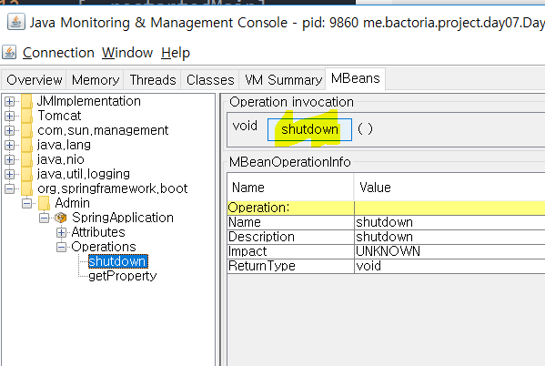

# Day 07. SpringApplication 커스터마이징과 Admin 기능(MBeans)

**`Spring Boot Reference v2.0.2 ( 23.6 ~ 23.10 )`**

&nbsp;

### Web Environment

웹 환경을 바꿀 수 있다.

이전에는 `True / False` 로 작성했지만,

스프링 부트 2.0 부터는 `Reactive` 가 추가되면서 아래와 같이 작성한다.

```java
public static void main(String[] args) {

       SpringApplication springApplication = new SpringApplication(Day07Controller.class);

       //아래의 세가지 타입 중 하나 사용
       springApplication.setWebApplicationType(WebApplicationType.NONE);
       springApplication.setWebApplicationType(WebApplicationType.REACTIVE);
       springApplication.setWebApplicationType(WebApplicationType.SERVLET);

       springApplication.run(args);
```

&nbsp;

### Args 만들기

```
SpringApplication.run(Day07Controller.class,"--hello=Hello","--hello=World");
```

hello 라는 key를 가진 args를 2개 받았다.

&nbsp;

**HelloService.java**

```java
@Service
public class HelloService {

    @Autowired
    ApplicationArguments arguments;


    public String getMessage() {
        List<String> helloValues = arguments.getOptionValues("hello");
        return helloValues.stream().collect(Collectors.joining(","));
    }
}
```

key가 hello인 args들의 값을 받아온다.

&nbsp;

```java
@GetMapping("/")
   public String helloMessage() {
       return helloService.getMessage();
   }

```

&nbsp;

**Controller 추가**
```java
@Autowired
   HelloService helloService;

@GetMapping("/")
   public String helloMessage() {
       return helloService.getMessage();
   }
```

localhost:port 로 접속하면 **hello, world** 가 떠야한다.

&nbsp;

**localhost:8080**
```
Hello, World
```


&nbsp;
&nbsp;

### ApplicationRunner / CommandLineRunner

아래의 `run()` method 는 `SpringApplication.run` 의 실행이 완료되기 직전에 호출됨

**ApplicationRunner 구현**

```java
@Component
public class MyBean implements ApplicationRunner {

    @Override
    public void run(ApplicationArguments args) throws Exception {

    }
}
```

&nbsp;

**CommandLineRunner 구현**
```java
@Component
public class MyBean implements CommandLineRunner {

    @Override
    public void run(String... args) throws Exception {

    }
}
```

둘중에 하나 사용하면 되고, 차이점은 args 를 객체로받냐 String... 으로 받냐 차이이다.

&nbsp;

#### 두개 이상의 Runner에 순서 부여

**MyBeanFirst.class**
```java
@Component
@Order(2)
public class MyBeanFirst implements ApplicationRunner {

    @Override
    public void run(ApplicationArguments args) throws Exception {
        System.out.println("This is First Runner!");
    }
}
```

&nbsp;

**MyBeanSecond.class**
```java
@Component
@Order(2)
public class MyBeanSecond implements ApplicationRunner {

    @Override
    public void run(ApplicationArguments args) throws Exception {
        System.out.println("This is Second Runner!!");
    }
}
```

&nbsp;

**어플리케이션 실행결과**
```
...생략

2018-06-15 14:52:27.547  INFO 17012 --- [  restartedMain] o.s.j.e.a.AnnotationMBeanExporter        : Registering beans for JMX exposure on startup
2018-06-15 14:52:27.737  INFO 17012 --- [  restartedMain] o.s.b.w.embedded.tomcat.TomcatWebServer  : Tomcat started on port(s): 8080 (http) with context path ''
2018-06-15 14:52:27.754  INFO 17012 --- [  restartedMain] m.b.project.day07.Day07Controller        : Started Day07Controller in 14.436 seconds (JVM running for 16.508)
This is First Runner!
This is Second Runner!!
```

&nbsp;
&nbsp;


### 관리자 기능

`spring.application.admin.enabled` 를 이용하여 스프링 부트 어플리케이션의 관리자 기능을 원격으로 사용할 수있다.

property에 `spring.application.admin.enabled=true` 를 추가하고

어플리케이션을 실행한다.

`jconsole`을 이용하여 shutdown 을 시킬 수가 있다.

&nbsp;

**cmd**
```
jconsole
```

**jconsole**


`spring.application.admin.enabled=true` 덕분에

`org.springframework.boot` 폴더가 활성화되었다.

&nbsp;
&nbsp;

### 참고자료

[Spring Boot Reference Guide - 2.0.2.Release](https://docs.spring.io/spring-boot/docs/2.0.2.RELEASE/reference/htmlsingle/#using-boot-maven)

[스프링 부트 2.0 Day 6. 배너 그리고 SpringApplication - by 백기선 님](https://youtu.be/38UK7BRJf1o)
